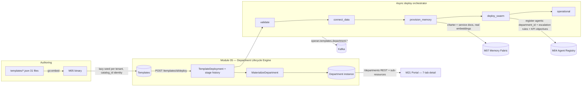

# Departments — Design & Architecture

**Status:** Current as of 2026-07-24 (commit `8c65d79`, verified live on the cluster)
**Owner modules:** M05 (Department Lifecycle Engine) with M04, M07, M03, M09, M02
**Audience:** anyone building on, reviewing, or extending the department operating model.

This document explains what a department *is* in Operan, where its business logic lives,
how the data flows end to end from an authored template to a running, governed unit, and
what is honestly not implemented yet. Every claim maps to code paths cited inline.

---

## 1. Concept model: Template vs Department

Two first-class entities, both owned by Module 05
(`modules/05-department-template-engine/internal/store/models.go`):

| Entity | What it is | Lifecycle |
|---|---|---|
| **Template** | A department *blueprint*: the full operating model as data. 31 ship built-in. | Authored as JSON, embedded in the binary, seeded per tenant, versioned. |
| **Department** | A *living instance* materialized from a template at deploy time. Holds the same operating model **plus** runtime linkage: real agent ids (M04), memory refs (M07), deployment/stage history. | `provisioning → operational` (or `degraded`), then `suspended`/`archived`. |

The separation matters: templates are catalog data (immutable identity via `catalog_id`),
departments are tenant-owned state that accumulates history. Deploying the same template
twice yields two independent departments.

### The Department entity (store/models.go:209)

```
Department
├─ identity        id, tenant_id, name, slug, category, template_id/version, deployment_id
├─ status          provisioning | operational | degraded | suspended | archived
├─ business logic  mission, BusinessLogic{purpose, value_proposition, activities,
│                                        stakeholders, operating_cadence}
├─ org chart       []Position   (chain of command — §3.1)
├─ services        []ServiceOffering (service portfolio — §3.2)
├─ value chain     []ValueStream (§3.3)
├─ governance      []GovernanceRule, []OperationalPolicy, []ComplianceControl (§3.4)
├─ risk & quality  []RiskItem, []QualityStandard (§3.5)
├─ measurement     []KPIDefinition (target/warning/critical thresholds)
└─ runtime links   agent_ids (M04), workflow_ids, memory_refs (M07), environment
```

---

## 2. Where the business logic is captured

The operating model is **authored as data** in the 31 template JSONs
(`modules/05-department-template-engine/templates/*.json`), validated against
`contracts/v1/schema-05-department-template-engine.json`, and embedded into the M05
binary via `go:embed` (`internal/handlers/seed_validate.go`). Nothing is hard-coded in
the portal; the portal renders whatever M05 serves.

Each template captures, in one file per department×size:

- **Why the department exists** — `business_logic` (purpose, value proposition, core
  activities, stakeholders, operating cadence: the rituals like daily digest / weekly
  service review).
- **Who does what and who answers to whom** — `agents[]` (canonical schema: role,
  capabilities, model, system_prompt, tool_requirements, constraints, access_control,
  reports_to, autonomy_tier) and `org_chart[]` (positions — §3.1).
- **What the department delivers** — `services[]` and `workflows[]` (each workflow is an
  SOP with typed steps, triggers, error handling).
- **What outcomes it drives** — `value_streams[]` + `kpis[]`.
- **What can go wrong and what good looks like** — `risks[]`, `quality_standards[]`.
- **What rules bind it** — `governance_rules[]`, `operational_policies[]` (per-agent
  allowed/denied action lists), `compliance_controls[]` mapped to frameworks
  (ITIL-v4, ISO-27001, NIST-CSF on the flagships).

**Template-size philosophy** (from `templates/README.md`): small/medium/large variants
model 2–5 / 5–20 / 20–50 FTE departments with correspondingly deeper hierarchy and
governance. The 7 IT/IT-Ops flagships are fully enriched reference models; the other 24
carry the canonical agent schema + org charts, with services **derived** (§4, stage 2a).

---

## 3. The operating-model schemas

### 3.1 Org chart & chain of command — `Position`

```
Position{ id, title, role_type(director|manager|specialist|coordinator|analyst|support),
          holder_type(ai_agent|human|vacant), agent_def_id → template agent (blueprint),
          agent_id → provisioned M04 agent (instance only), human_ref,
          reports_to → Position.id, unit, autonomy_tier(recommend|analyze|coordinate|draft|execute),
          decision_rights: []DecisionRight{decision, authority(decide|recommend|veto), limit},
          escalates_to, approval_gate_refs → M09 gate names }
```

The chain of command is **not decorative**:

1. `validate` (deploy stage 2) rejects org charts with reporting **cycles**, **dangling
   `reports_to`**, or **no root position** (`internal/validate/validate.go:97-292`).
2. At `deploy_swarm`, reporting lines are compiled into M04 escalation rules on each
   registered agent: `reports_to:agent-def:<id>`, `escalate_to:<target>`,
   `autonomy_tier:<tier>` (`internal/deploy/orchestrator.go:326-347`). The org chart
   therefore *travels with the agent* into the registry.
3. `execute`-tier autonomy is always gated: positions carry `approval_gate_refs` that
   name M09 approval gates; the runtime work loop (§5) creates real human tasks + gates.

### 3.2 Service portfolio — `ServiceOffering`

```
ServiceOffering{ id, name, description, owner_position_id, owner_agent_def_id,
                 consumers[], sla{availability, response_time, resolution_time, coverage},
                 delivery_workflow_id → WorkflowDefinition.id, kpi_refs[] → KPIDefinition.id,
                 request_channel, status }
```

Every service says **what** is delivered, **to whom**, **at what service level**, **which
workflow (SOP) delivers it**, and **which KPIs measure it**. When a template defines no
services, they are derived one-per-workflow at materialization — each SOP the department
runs *is* a service, owned by the org root (`orchestrator.go: servicesOf`). Derivation is
grounded in the template's own workflows; nothing is invented.

### 3.3 Value chain — `ValueStream`

```
ValueStream{ id, name, description, stages: []ValueStage{inputs → activities → outputs},
             outcome, business_outcome, value_metric_kpi_refs[] }
```

This is the value-realization answer: inputs → activities → outputs → outcome →
business outcome, with KPIs as evidence. Fully populated on the 7 flagships (see gap G2).

### 3.4 Governance & compliance

- `GovernanceRule{type: access_control|data_usage|rate_limit|audit|compliance,
  enforcement: enforce|warn|log, conditions, actions}`
- `OperationalPolicy{scope: agent|workflow|department|system, rules[]}` — carries the
  per-agent **autonomy boundaries** (explicit allowed/denied action lists).
- `ComplianceControl{framework, control_id, applies_to, agent_def_ids[],
  governance_rule_refs[], evidence_kpi_refs[], status}` — maps department practice to
  named framework controls, with KPIs as evidence pointers.

### 3.5 Risk & quality

- `RiskItem{category, severity, likelihood, mitigation, owner_position_id, scope,
  service_ref, review_cadence, status}` — a real risk register with named owners from
  the org chart.
- `QualityStandard{type, target, measure_kpi_ref, scope, service_ref, enforced_by}` —
  quality targets bound to KPIs and enforcement points.

---

## 4. End-to-end data flow



**Stage-by-stage** (`internal/deploy/orchestrator.go`; every stage appends a
`StageRecord{stage, status, detail, started_at, completed_at}` to the deployment):

| Stage | Real work performed |
|---|---|
| `select` | Deployment record created; department materialized in `provisioning`. |
| `configure` (validate) | Full template validation: org-chart cycles, dangling `reports_to`, missing root, dangling service→workflow/KPI refs. Fail → pipeline stops. |
| `connect_data` | Template integrations recorded on the department. |
| `provision_memory` | Builds **department documents** — a charter (mission + value proposition + activities) and one doc per service (incl. SLA + consumers) — and stores them in M07 with `embedding_type: department`. These are **real embeddings** through LiteLLM (qwen3-embedding-4b), hence the 120 s memory-client timeout (`internal/clients/clients.go`). Returned doc ids → `department.memory_refs`. |
| `deploy_swarm` | Each template agent is registered in **M04** with `department_id`, chain-of-command escalation rules (§3.1), and KPI-derived objectives. Returned agent ids are written into the matching `Position.agent_id` — the org chart holds live agent references. |
| `operational` | Department status flips; `department.operational` event; legacy `template.deployed` kept for M11 compat. |

**Failure semantics:** any stage failure marks the stage `failed`, the deployment
`failed`, the department `degraded`, and publishes
`department.provisioning_failed`. Nothing pretends to succeed (verified live: the first
cluster deploy failed at `provision_memory` on a timeout and surfaced exactly this way).

**Events** (`internal/events/departments.go`, topic prefix `operan.templates.department`):
`created`, `stage_advanced`, `agent_provisioned`, `operational`,
`provisioning_failed`, `updated`, `archived`.

**Persistence:** M05 snapshots templates + deployments + departments to hostPath
`/var/lib/operan/department-templates` (Module 07's snapshot pattern), restoring on
boot — verified live across a pod restart mid-smoke.

**Concurrency guard:** deployments driven by the server-side orchestrator reject client
`PATCH` stage updates with `409` — the old client-driven cosmetic pipeline can't corrupt
real ones.

---

## 5. Runtime: how a department does work

The department work loop (M05 `internal/workloop`) is the production path — a
service request is the unit of demand, and the run is fully governed:

```
POST /departments/{id}/requests            (service_id, title, body, priority)
  → SLA clocks stamped from the service's declared levels (sla.Parse by priority)
  → resolveWorkflowDef: service.delivery_workflow_id → template.workflows[]
  → deploy.CompileWorkflow → PER-REQUEST M03 workflow (request context in
    variables; error_strategy abort; fallback single-gate "manual handling"
    when no SOP resolves)
  → M03 DAG engine executes: agent nodes → shared internal/draft engine (M07
    memory → Qwen via LiteLLM); human_gate nodes → M03 human task + M09
    approval (request_id = task id; US-402 gates consumer flips the task)
  → M05 poller (15s) mirrors run state onto the request: timeline events
    (created/dispatched/agent_output/gate_raised(+node)/gate_responded/
    completed/failed), first_response_at, tokens_used, awaiting_approval via
    recorded GateNodeIDs, final output, sla_breached (once), "run lost" fail
    after 8 unauthorized/unreachable reads
```

Two rhythms sit on top of the loop:

- **Operating cadence** (`internal/cadence`): a scheduler fires each live
  department's `business_logic.operating_cadence` entries — daily at
  `MODULE05_CADENCE_HOUR` (07:00 default), weekly on Monday
  (`MODULE05_CADENCE_TICK` = test override). Stats are gathered from the
  request ledger and the digest is drafted by the department head's agent via
  M03 `/agent/draft` under a self-minted HS256 service JWT (issuer
  `operan-tenant-control-plane`, role admin); a stats-only fallback files when
  drafting is unavailable. Briefings are snapshot-persisted (`briefings.json`,
  bounded 30/department) and served at `GET /briefings`.
- **Measurement** (`internal/handlers/measurements.go`):
  `GET /departments/{id}/kpi-measurements` computes 7d/30d windows from the
  ledger (counts, completion %, SLA response/resolution compliance %, median
  cycle, median gate turnaround from paired gate timeline events, tokens + USD
  at `MODULE05_TOKEN_RATE`) and maps template KPI definitions conservatively —
  `measured:false` + "no data source yet" where nothing backs them.

v1 limits (accepted, documented): M03 runs don't survive its restarts (M05
fails the request honestly); gate waits hold one goroutine each; per-request
caller tokens expire (~1h), so a gate held longer than the token's life ends
in an honest "run lost" failure; monthly/quarterly cadences are declared on
templates but not yet scheduled.

The legacy pipeline path (`/pipeline` → `/executions` → `/human-tasks`) remains
for the portal's guided Story runner; the Workflows/Tasks views run entirely on
the work loop above.

---

## 6. API surface (M05)

Portal-facing base: `/svc/templates/*` (proxy strips the prefix; no extra path prefix).

| Endpoint | Purpose |
|---|---|
| `GET/POST /templates`, `GET/PATCH/DELETE /templates/{id}` | Catalog CRUD (list lazily seeds the 31 built-ins per tenant) |
| `POST /templates/seed` | Explicit re-seed |
| `POST /templates/{id}/validate` | Full operating-model validation report |
| `POST /templates/{id}/deploy` | Start the server-side pipeline (**admin JWT required**) |
| `GET /templates/{id}/deployments`, `GET .../deployments/{depId}` | Deployment + stage history (poll target) |
| `GET /departments`, `GET /departments/{id}` | Instances (list carries summary counts) |
| `PATCH /departments/{id}`, `DELETE /departments/{id}` | Update / archive (agents remain in M04, noted in the response) |
| `GET /departments/{id}/org-chart` | Nodes + reporting edges (root + edges resolved) |
| `GET /departments/{id}/services · /value-chain · /risks · /quality · /compliance` | Operating-model sub-resources |
| `GET/POST /departments/{id}/requests` | The work ledger + the department's front door (POST needs an operational department + owned service_id) |
| `GET /requests/{id}`, `POST /requests/{id}/cancel` | One request with full timeline; cancel while non-terminal |
| `GET /departments/{id}/kpi-measurements` | Ledger-derived 7d/30d metrics + honest KPI mapping |
| `GET /briefings?department_id&limit` | Operating-cadence digests, newest first |

**Auth & tenancy:** every call requires a JWT signed with the shared `operan-jwt`
secret, issuer `operan-tenant-control-plane` (M02 issues this since `97d1944`), plus
`X-Tenant-ID`. Deploy additionally requires the `admin` role. All reads/writes are
tenant-scoped; templates are seeded per tenant so tenants can diverge safely.

---

## 7. UI mapping (M21 department detail)

| Tab | Data source | Shows |
|---|---|---|
| Overview | `GET /departments/{id}` | Mission, value proposition, stakeholders, operating cadence, value streams, "Let the agent work" |
| Org Chart | `/org-chart` + M04 names | Reporting tree, unit chips, autonomy tier, DECIDE/RECOMMEND/VETO badges with limits, M09 gate refs; nodes link to agent pages |
| Services | department.services + KPI name resolution | Portfolio table: owner, consumers, SLA, measured-by KPIs |
| Governance | governance_rules + operational_policies + compliance_controls | Rules w/ enforcement, autonomy boundaries, framework-mapped controls |
| Risk & Quality | risks + quality_standards | Register w/ severity/likelihood/mitigation/owner; quality targets |
| KPIs | kpis | Target / warning / critical thresholds |
| Staff | M04 agents filtered by `department_id` | Live agents, status, links to agent detail (incl. M07 memory state) |

---

## 8. Verified live (cluster, in-browser)

- 31-template catalog seeds and renders grouped by category with size variants.
- Deploy from the UI → real pipeline stages → operational; agents present in M04 with
  escalation rules; 9 memory docs in M07; org positions hold live agent ids.
- All 7 detail tabs render real data; org chart → agent navigation works.
- Work flow end-to-end: Qwen draft → pipeline → execution → human task → gate visible
  in the Supervision queue.
- Archive from the UI; department survives pod restarts (hostPath snapshots).
- Failure path exercised for real (memory timeout → stage failed → department degraded).

---

## 9. Former gaps — all closed 2026-07-24 (commits `4c12e08`…`33b2624`, live-verified)

| # | Gap | How it was closed |
|---|---|---|
| G1 | Department memory not fed into drafts | M07 `/search` now **enforces** the metadata filters its contract declared; M03 `/agent/draft` accepts `department_id` and merges charter/service context into the prompt (portal passes it). Verified: fresh marketing lead's draft grounded in a department service doc. |
| G2 | Value streams on flagships only | Authored per-category value chains grounded in each template's actual workflows (KPI-linked), applied to all 24 templates (`v1.1.0`); seeder **upserts** on catalog version bumps via `TemplateStore.RefreshFromCatalog`, so existing tenants receive enrichments. |
| G3 | M11 blind to department lifecycle | All 7 `operan.templates.department.*` topics added to `DefaultConsumeTopics`. Verified: 23 department spans ingested after a live deploy. |
| G4 | SOPs not executable | New `deploy_workflows` pipeline stage compiles each `WorkflowDefinition` into a real M03 workflow (typed nodes, sequential edges, agent refs resolved to live M04 ids); `department.workflow_ids` holds real M03 ids. Verified: 5 SOPs live in M03 with `department_id`. |
| G5 | Human positions unbound | Org chart resolves `human_ref` against M02 `/users` at render — bound holders show the IAM identity, unmatched show an explicit "unbound" tag. `hr-large` now ships a human CHRO chair (GARDEN: 1 human + AI deputies). |
| G6 | M06→M07 drift | Ingestion client rewritten to the current `/vectors` contract with forwarded caller identity; M07 embeds server-side (per-chunk M12 round-trip removed); store failure **fails the job**. Verified E2E: url source → 3 chunks → 3 `platform` vectors in M07. En route this surfaced and fixed: request-scoped ctx killing async jobs, a Go-slice-in-SQL bug, NULL-scan crashes, a nil-map panic, and missing boot migrations/columns in M06. |

---

## 10. File map

| Concern | Path |
|---|---|
| Entities (Template, Department, Position, ServiceOffering, ValueStream, RiskItem, QualityStandard, ComplianceControl, …) | `modules/05-department-template-engine/internal/store/models.go` |
| Deploy orchestrator + materialization + service derivation + memory docs + M04 registration | `modules/05-department-template-engine/internal/deploy/orchestrator.go` |
| Validation (org cycles, dangling refs) | `modules/05-department-template-engine/internal/validate/validate.go` |
| M04/M07 clients (timeouts: 10 s registry / 120 s memory) | `modules/05-department-template-engine/internal/clients/clients.go` |
| Department events | `modules/05-department-template-engine/internal/events/departments.go` |
| Routes | `modules/05-department-template-engine/internal/handlers/router.go` |
| Embedded catalog + seeding + validate endpoint | `modules/05-department-template-engine/internal/handlers/seed_validate.go`, `templates/*.json` |
| Contract | `contracts/v1/schema-05-department-template-engine.json` (+ openapi/asyncapi) |
| Portal views | `modules/21-experience-portal/web/app/js/views/departments.js` (list/catalog/deploy/detail/work), `agents.js` (agent + memory) |
| Template design framework (GARDEN, sizes, role taxonomy, cross-dept dependencies) | `modules/05-department-template-engine/templates/README.md` |
